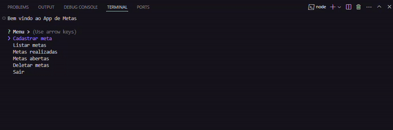

# 📝 Lista de Metas

Um projeto simples de Lista de Metas desenvolvido em JavaScript e Node.js, que permite ao usuário gerenciar suas metas de forma eficiente, onde toda a interação é realizada pelo terminal.



## 🛠️ Tecnologias Utilizadas

- **JavaScript**: Linguagem de programação principal do projeto.
- **Node.js**: Ambiente de execução para JavaScript no lado do servidor.
- **JSON**: Formato para armazenar as metas.
- **[inquirer](https://www.npmjs.com/package/inquirer)**: Biblioteca para criar prompts interativos e amigáveis, melhorando a experiência do usuário.

## ⚙️ Funcionalidades

- 📝 **Cadastro de Metas**: Cadastre suas metas, que serão armazenadas no arquivo JSON.
- 📖 **Exibição e Conclusão de Metas**: Visualize todas as metas do usuário e marque como concluídas ou não.
- ✅ **Metas Concluídas**: Exibe todas as metas que foram concluídas.
- ⭕ **Metas Abertas**: Exibe todas as metas que ainda estão pendentes.
- ❌ **Remoção de Metas**: Permite deletar metas, removendo-as também do arquivo JSON.
- 🏃‍♂️ **Encerrar o Programa**: Selecione "Sair" para encerrar o programa. Os dados são preservados no arquivo JSON, mesmo após o encerramento.

## ✅ Requisitos

- [](https://nodejs.org/) Node.js

## 🚀 Como Rodar o Projeto

1. Clone o repositório:

```bash
git clone https://github.com/joschonarth/nlw-pocket-js
```

2. Navegue até o diretório do projeto:
```bash
cd nlw-pocket-js
```

3. Instale as dependências:
```bash
npm install
```

4. Execute o programa:
```bash
node index.js
```

## 📂 Estrutura do Projeto 

- `index.js`: Arquivo principal que executa o programa.
- `metas.json`: Arquivo JSON onde as metas são armazenadas.

## 📞 Contato 

<div>
    <a href="https://www.linkedin.com/in/joschonarth/" target="_blank"></a>
    <a href="mailto:joschonarth@gmail.com" target="_blank"></a>
</div>